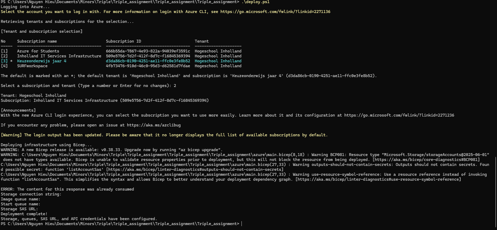
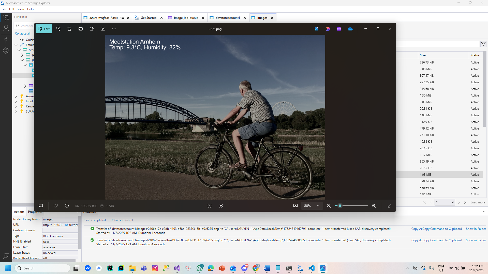

# Triple Assignment
## Name: Nguyen Luong Ngoc Hieu-745740

## Task Requirement
- Using azure functions, create an app that exposes an HTTP endpoint that starts an image creation process and returns a unique id for that process. This id can be used to either fetch the status of the running process, or the results of the completed process. The results will be a list of links to each generated image. These images are served from blob storage.
- The image creation process consists of multiple jobs. The first job fetches data for 50 weather stations. For each weather station, a separate job should be run to grab a public image and add the weather data to that image, in a fan-out fashion. After the image has its weather data, the job should store it in the blob storage.

**MUST**

o	Expose publicly accessible API for requesting a set of fresh images with current weather data using a HttpTrigger.

o	Employ QueueTrigger to process the job in the background so the initial call stays fast.

o	Employ Blob Storage to store all generated images and to expose the files.

o	Employ Buienrader api to get weather station data
	https://data.buienradar.nl/2.0/feed/json

o	Employ any public api for retrieving an image to write the weather data on.
	e.g. https://unsplash.com/developers

o	Expose a publicly accessible API for fetching the generated images using HttpTriggers.

o	Provide HTTP files as API documentation.

o	Create a fitting Bicep template (include the queues as well).

o	Add all files to GitHub repo and add triplegh2025 (https://github.com/triplegh2025) or triplegithub2025@outlook.com  to organization and project.

o	Create a deploy.ps1 script that publishes your code using the dotnet cli, creates the resources in azure using the Bicep template and deploys the function using the azure cli.

o	Employ multiple queues, one for starting the job and one for fetching and updating an image.

o	Deploy the code to azure and have a working endpoint.

**COULD**

o	Use SAS token instead of publicly accessible blob storage for fetching finished image directly from Blob.

o	Build and deploy the code automatically from GitHub.

o	Use authentication on request API. (Be sure to provide me with credentials)

o	Provide a status endpoint for fetching progress status and saving status in Table.

## Project Structure (Will be updated)
```
Triple_assignment/
├─ src/
│  ├─ Triple_assignment
│  ├─ Program.cs
│  ├─ Functions/
│  │  ├─ HttpStartFunction.cs        → Starts a new job (HTTP)
│  │  ├─ HttpGetStatus.cs            → Checks job status (HTTP)
│  │  ├─ HttpGetImages.cs            → Fetches completed image URLs (HTTP)
│  │  ├─ StartJobQueueProcessor.cs   → Processes job queue (QueueTrigger)
│  │  └─ ImageJobProcessor.cs        → Processes individual images (QueueTrigger)
│  ├─ Services/
│  │  ├─ WeatherService.cs           → Gets weather data from Buienradar
│  │  ├─ ImageService.cs             → Gets base images from Unsplash & overlays weather data
│  │  └─ StorageService.cs           → Uploads & retrieves from Blob Storage
│  └─ Utilities/
│     └─ ImageHelper.cs              → Draws weather info on images
├─ azure/
│  └─ main.bicep                     → Infrastructure (Function App, Storage, Queues)
├─ deploy.ps1                        → PowerShell deploy script
├─ api.http                          → API documentation/test requests
└─ README.md
```
## Running Locally
1. Restore dependencies:
```C
dotnet restore
```

2. Run the function app:
```C
func start
```
3. Test the API endpoints using PowerShell
```C
# Start a new job
$response = Invoke-RestMethod -Uri "http://localhost:7071/api/start" -Method POST
$processId = $response.processId

# Check job status
$status = Invoke-RestMethod -Uri "http://localhost:7071/api/status/$processId" -Method GET

# Fetch images
$images = Invoke-RestMethod -Uri "http://localhost:7071/api/images/$processId" -Method GET
```

## Deployment
1. Deploy infrastructure and function app via PowerShell:
```C
powershell.exe -ExecutionPolicy Bypass -File .\deploy.ps1 -resourceGroup Hieu -location swedencentral -prefix triple
```

This script:
- Logs into Azure.
- Creates the resource group.
- Deploys resources using main.bicep.
- Builds and publishes the Function App.

## Set the missing env var  code expects
```C
az functionapp config appsettings set -g Hieu -n triple-func-obpnd3sto4eio --settings "AZURE_STORAGE_CONNECTION_STRING=DefaultEndpointsProtocol=https;AccountName=triplesaobpnd3st;AccountKey=6fTthgVuqKUIJleuIDjtKkK3YHhoCBRfDItYiluKdw4oBhGnGfKzxItXBhF0+Gkaw9ya/Z6o0xKp+AStsS+NsQ==;EndpointSuffix=core.windows.net"
```

## Restart the Function App
```C
az functionapp restart -g Hieu -n triple-func-obpnd3sto4eio
```

## Test /start
```C
curl -i -X POST "https://triple-func-obpnd3sto4eio.azurewebsites.net/api/start" -u admin_hieu:neko-chann -H "x-functions-key: vovH4kaO4Z3VnuD_w3Jfx64g2yrydBrvZX2O23DqJRgqAzFuXwZMEg=="
```

## Run this command on PowerShell to get the ProcessID
```C
$response = Invoke-RestMethod `
  -Uri "https://triple-func-obpnd3sto4eio.azurewebsites.net/api/start" `
  -Method POST `
  -Headers @{
      "x-functions-key"="vovH4kaO4Z3VnuD_w3Jfx64g2yrydBrvZX2O23DqJRgqAzFuXwZMEg=="
  } `
  -Credential (New-Object System.Management.Automation.PSCredential(
      "admin_hieu",
      (ConvertTo-SecureString "neko-chann" -AsPlainText -Force)
  ))

$response.processId
```

## After get the ProcessID, run this command 
```C
curl -i "https://triple-func-obpnd3sto4eio.azurewebsites.net/api/status/74efb2e2-ee41-4c8a-a4ca-46c8a9a7cdf3" -u admin_hieu:neko-chann -H "x-functions-key: vovH4kaO4Z3VnuD_w3Jfx64g2yrydBrvZX2O23DqJRgqAzFuXwZMEg=="
```

## Environment & Dependencies
- .NET SDK 8.0
- Azure Functions Core Tools
- Azure CLI
- Azure Storage Account
- Azure Function App

## Result in Could requirements


- You can see in the activities, the item uses SAS token and successfully declare in the result

## Credentials
- Please check in the local.setting.json
